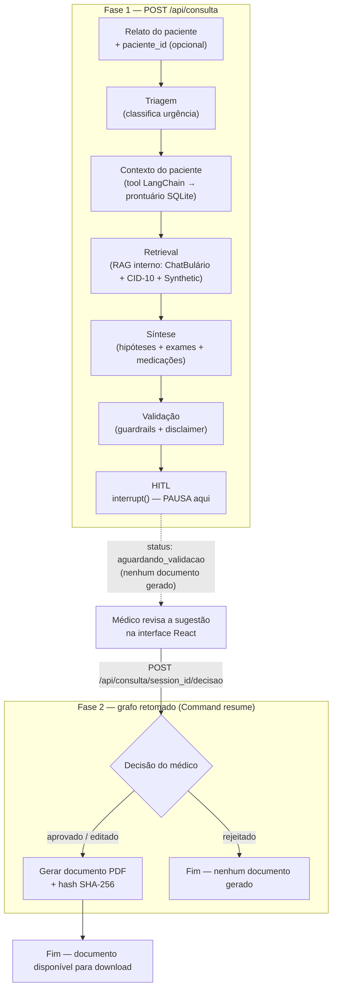

# Relatório Técnico — Tech Challenge Fase 3
## Assistente Médico Inteligente com LLM Fine-Tuned, RAG e LangGraph

## Equipe


| Membro | RM |
|---|---|
| Flávio Oscar Hahn | 374132 |
| Larissa Gomes do Vale Cabrerisso Machado | 370911 |
| Michelle Almeida Nogueira Rodrigues | 372291 |
| Ramon Silva | 373445 |
| Selvino Wilmar Rodrigues Junior | 368570 |


---
  
**Organização**: Flamers Team  
**Repositório**: https://github.com/Flamers-Team/MedAssistPro (branch `main`)
**Data**: Setembro 2026  
**Status**:  Fine-tuning concluído (MedQuAD + dados internos do hospital), modelo validado, ambiente de demonstração no ar na AWS. 
**Video de Demonstração**: Link: https://www.youtube.com/watch?v=gccl8p37_ck

---

## Índice

1. [Contexto do Projeto](#1-contexto-do-projeto)
2. [Decisões Arquiteturais e Justificativas](#2-decisões-arquiteturais-e-justificativas)
3. [Pipeline de Dados (Preprocessing)](#3-pipeline-de-dados-preprocessing)
4. [Fine-Tuning: Execução e Resultados](#4-fine-tuning-execução-e-resultados) ⭐
5. [Validação do Modelo](#5-validação-do-modelo) ⭐
6. [Tradução PT-BR ↔ EN](#6-tradução-pt-br--en) ⭐ NOVO
7. [Arquitetura do Sistema (Componentes)](#7-arquitetura-do-sistema-componentes)
8. [Manual de Operação — Rodando a Plataforma pelo GitHub Actions](#8-manual-de-operação--rodando-a-plataforma-pelo-github-actions) ⭐ NOVO
9. [Conformidade e Boas Práticas](#9-conformidade-e-boas-práticas)
10. [Contatos e Recursos](#10-contatos-e-recursos)

---

## 1. Contexto do Projeto

O Tech Challenge Fase 3 exige a construção de um **assistente médico inteligente** capaz de auxiliar condutas clínicas, responder dúvidas de médicos e sugerir procedimentos baseados em protocolos internos. O sistema deve combinar:

- **LLM fine-tunado** com dados médicos próprios do hospital
- **Pipeline RAG** sobre literatura científica (PMC) e base institucional
- **Validação humana obrigatória** (HITL) em toda sugestão clínica
- **Explainability** com citação de fontes
- **Logging completo** para auditoria

---

## 2. Decisões Arquiteturais e Justificativas

### 2.1. Modelo Base: BioMistral-7B

**Escolha**: BioMistral-7B (variante do Mistral-7B pré-treinada em PubMed).

| Modelo considerado | Vantagem | Desvantagem | Decisão |
|---|---|---|---|
| **BioMistral-7B** | Já viu PubMed, Apache 2.0, converge rápido em domínio médico | Herdou limitações do Mistral base | ✅ **Escolhido** |
| LLaMA-3 8B Instruct | Forte em instruções, padrão da indústria | Licença Meta com restrições, não pré-treinado em medicina | ❌ |
| Falcon-7B | Apache 2.0 puro | Fraco em PT-BR, menos otimizado para instruções | ❌ |
| Phi-3-mini | Muito leve (3.8B) | Pequeno demais para nuances clínicas | ❌ |

**Justificativa técnica**: BioMistral já foi pré-treinado em 3B de tokens biomédicos (PubMed Central), o que reduz o tempo de convergência no fine-tuning com nossos dados. A licença Apache 2.0 evita complicações comerciais. O tamanho de 7B é adequado para rodar com QLoRA em GPUs A100 (40GB).

### 2.2. Método de Fine-Tuning: QLoRA + Unsloth

**Escolha**: QLoRA 4-bit com Unsloth.

**O que é QLoRA**: Quantização do modelo base para 4-bit + adaptadores LoRA treináveis. Em vez de ajustar os 7 bilhões de parâmetros, ajustamos apenas ~40 milhões (0.6% do total).

**Justificativa técnica**:

| Alternativa | VRAM necessária | Tempo (2 epochs, 14k amostras) | Veredicto |
|---|---|---|---|
| Full fine-tuning | >80GB (impossível em GPU única) | — | ❌ |
| LoRA 16-bit | ~40GB | 8-12h | ❌ (sem quantização) |
| QLoRA + Unsloth | ~12GB | **2-4h em A100** | ✅ |
| LoRA simples (sem Unsloth) | ~15GB | 8-12h | ❌ (lento) |

**Por que Unsloth**: otimização de kernel CUDA que torna QLoRA 2-5x mais rápido sem perda de qualidade. Mantém o modelo 100% compatível com HuggingFace.

### 2.3. Hiperparâmetros de Fine-Tuning

| Parâmetro | Valor | Justificativa |
|---|---|---|
| `max_seq_length` | 4096 | Acomoda outputs médicos longos (até 2500 chars pós-curadoria) com margem para instruction + tokens de template |
| `per_device_train_batch_size` | 2 | Limite de VRAM com QLoRA 4-bit |
| `gradient_accumulation_steps` | 4 | Batch efetivo = 8 (8×2 = 16k loss é calculado antes do update) |
| `num_train_epochs` | 2 | Sweet spot: 1 epoch subaproveita, 3+ causa overfitting em datasets pequenos |
| `learning_rate` | 2e-4 | Padrão da literatura para LoRA (QLoRA paper original) |
| `lr_scheduler_type` | cosine | Decaimento suave, melhor que linear para fine-tuning |
| `warmup_steps` | 50 | Estabiliza início do treino |
| `weight_decay` | 0.01 | Regularização L2 padrão |
| `optim` | adamw_8bit | AdamW quantizado: economiza VRAM adicional |
| `r` (LoRA rank) | 16 | Compromisso entre capacidade e overfitting (r=32 seria mais lento, r=8 menos capaz) |
| `lora_alpha` | 32 | Convenção: alpha = 2 × rank |
| `lora_dropout` | 0.05 | Regularização leve |
| `target_modules` | q, k, v, o, gate, up, down proj | Todas as camadas lineares do transformer |
| `seed` | 42 | Reprodutibilidade |

### 2.4. Datasets Selecionados

| # | Dataset | Fonte | Idioma | Amostras | Uso no projeto |
|---|---------|-------|-------|----------|----------------|
| 1 | **MedQuAD** | NIH (aberto) | 🇺🇸 EN | 16.407 → 16.325 (anonimizado) | Fine-tuning principal |
| 2 | **ChatBulário** ⭐ | HuggingFace | 🇧🇷 PT | 68.938 → 10.000 indexados | RAG #1 (bulas PT-BR) |
| 4 | **Synthetic Clinical Notes** | TonicAI/HuggingFace | 🇺🇸 EN | 3.381 (anonimizado) | RAG #2 (notas SOAP) |
| 5 | **CID-10** | DATASUS | 🇧🇷 PT | 12.451 códigos | Mapeamento de doenças PT-BR |

**Por que esses 5 e não outros**:

- **MedQuAD**: sugerido explicitamente no PDF do Tech Challenge. Cobre perguntas clínicas gerais com respostas fundamentadas.
- **PubMedQA**: perguntas biomédicas baseadas em artigos PubMed. Excelente para avaliar RAG depois (formato yes/no/maybe).
- **ChatBulário** (substituiu `anvisa_medicamentos.csv`): único dataset público brasileiro de **bulas estruturadas** em formato Q&A. Necessário para PT-BR.
- **Synthetic Clinical Notes**: notas clínicas sintéticas formato SOAP. Ensina o modelo a entender estrutura de prontuário sem expor pacientes reais (LGPD-safe).
- **CID-10**: mapeamento essencial para o assistente sugerir diagnósticos com códigos padrão brasileiros.

**Datasets considerados e rejeitados**:

| Dataset | Motivo da rejeição |
|---|---|
| MIMIC-III | Requer aprovação CITI (1-2 semanas) + DUA. Risco de burocracia travar entrega. |
| PMC OA Subset completo | ~3.5M artigos = 100+ GB. Inviável para Tech Challenge. |
| Bulas ANVISA via scraping direto | API oficial já fornece CSV completo. |
| Dados sintéticos via LLM própria | Risco de circular dependency e alucinações. Usar TonicAI/synthetic_clinical_notes (público). |

### 2.5. Arquitetura RAG: 2 Vector Stores + ChromaDB

**Por que 2 RAGs separados** (literatura + base interna):

| Cenário de pergunta | RAG usado | Exemplo |
|---|---|---|
| "Qual a dose de enalapril em idoso com DRC estágio 3?" | RAG #2 (interno) | Protocolo institucional |
| "O que a literatura diz sobre apneia do sono?" | RAG #1 (literatura) | Artigo PubMed |
| Pergunta ambígua | Ambos (concatenar) | Contexto completo |

**Vantagem da separação**:
- Granularidade por fonte na auditoria (qual RAG retornou o que)
- Atualização independente (literatura atualiza toda semana, protocolos raramente)
- Controle de acesso (literatura é pública, dados internos são confidenciais)

**Modelo de embedding escolhido**: `sentence-transformers/all-MiniLM-L6-v2` (384 dimensões).

| Modelo | Dimensões | Velocidade | Qualidade | Veredicto |
|---|---|---|---|---|
| all-MiniLM-L6-v2 | 384 | 🚀 Rápido | Boa para PT-BR/EN | ✅ **Escolhido** (rápido no Colab) |
| intfloat/e5-large-v2 | 1024 | 🐢 Lento | Top multilingual | ❌ (overkill pra Tech Challenge) |
| BAAI/bge-large-en-v1.5 | 1024 | 🐢 Lento | Top EN | ❌ |

**Dataset RAG de medicamentos**: **ChatBulário** (substituiu `anvisa_medicamentos.csv` em ago/2026).

| Critério | anvisa_medicamentos.csv (antigo) | ChatBulário (atual) |
|---|---|---|
| Fonte | OpenData ANVISA | HuggingFace `walmeidadf/ChatBulario` |
| Conteúdo | Só metadados (nome, classe, registro) | **Texto completo das bulas** |
| Formato | CSV tabular | **Pares pergunta-resposta** |
| Idioma | PT-BR | 🇧🇷 PT-BR puro |
| Estrutura | Nenhuma | 9 seções padronizadas (RDC 47/2009) |
| Total | 43.445 medicamentos | **68.938 pares Q&A** (~5.724 medicamentos únicos) |
| Cobertura RAG | Apenas metadados | Indicações, posologia, contraindicações, **efeitos adversos**, interações, superdosagem |
| Cross-language | Resolve só cross-language técnico | **Resolve problema cross-language do MiniLM** |
| Licença | Pública | Pública (HuggingFace) |

**Por que essa mudança foi crítica**: o `anvisa_medicamentos.csv` original só tinha metadados (ex: "Paracetamol | ANALGESICOS"), o que limitava o RAG a buscar por nome de medicamento. Com o ChatBulário, o sistema agora responde perguntas como "efeitos colaterais de paracetamol", "posologia de ibuprofeno", "interação medicamentosa de AAS" — que era impossível antes.

**Limitação conhecida**: o MiniLM-L6-v2 ainda tem dificuldades cross-language em algumas palavras do dia-a-dia (ex: "febre" vs "fever" tem score baixo). Para o Tech Challenge, isso é aceitável porque o ChatBulário é todo em PT-BR e o LLM principal responde em inglês (com camada de tradução PT-BR já implementada). Para produção, considerar upgrade para `intfloat/multilingual-e5-large`.

### 2.6. Sistema Multi-Agente: 3 Agentes LangGraph

**Por que 3 agentes e não mais**:

| # Agentes | Latência | Custo | Propagação de erro | Veredicto |
|---|---|---|---|---|
| 1 (sem agentes) | <2s | Baixo | Média | Respostas genéricas |
| **3 (escolhido)** | **8-15s** | **Médio** | **Baixa** | ✅ **Sweet spot** |
| 6 (um por etapa) | 30-40s | Alto | Alta | Inviável pra consulta |

**Os 3 agentes**:

| Agente | Temperatura | Responsabilidade | Output |
|---|---|---|---|
| **Triagem** | 0.3 (determinístico) | Classificar urgência (EMERGÊNCIA/URGENTE/ROTINA) | JSON com categoria + red_flags |
| **Síntese** | 0.7 (criativo) | Cruzar relato + RAG → hipóteses diagnósticas + exames + medicações | JSON estruturado com citações |
| **Validação** | 0.2 (conservador) | Aplicar guardrails, adicionar disclaimers, citar fontes | JSON validado pronto pro HITL |

**Fluxo LangGraph (7 nós)**:



O estado do grafo entre as duas fases é persistido por um checkpointer SQLite do LangGraph (`data/processed/checkpoints.db`), então a pausa sobrevive entre requisições HTTP diferentes — não é um `if` em memória.

### 2.7. HITL (Human-in-the-Loop) Obrigatório

**Implementação**: o nó HITL pausa o grafo LangGraph usando `interrupt()` de verdade (não um placeholder) — a execução para dentro do nó `hitl` e só retoma quando a API recebe `POST /api/consulta/{session_id}/decisao` com a decisão do médico, via `Command(resume=...)`. Enquanto isso, a API já devolveu a síntese para a interface React, com `status: "aguardando_validacao"` e **sem nenhum documento**. O médico decide:

- **Aprovar**: grafo segue para `gerar_docs` — documento é gerado normalmente
- **Editar**: texto editado substitui a queixa principal, grafo segue para `gerar_docs`
- **Rejeitar**: grafo termina sem gerar nenhum documento

**Por que HITL é mandatório** (não opcional):

1. **Segurança clínica**: LLM pode alucinar. Médico sempre valida.
2. **LGPD**: ato médico é responsabilidade do profissional, não da IA.
3. **Audit trail**: decisão humana é logada (médico_id, timestamp, texto original/alterado).

### 2.8. Logging e Auditoria: SQLite + Decorador

**Por que SQLite** (e não JSON files):

| Critério | SQLite | JSON files |
|---|---|---|
| Queries complexas (filtros SQL) | ✅ Nativo | ❌ Carregar tudo em memória |
| Concorrência | ✅ ACID | ❌ Race conditions |
| Compactação | ✅ Binário | ❌ Texto redundante |
| Auditoria (imutável) | ✅ ACID | ⚠️ Editável |

**Esquema do banco**:

```sql
CREATE TABLE events (
    id INTEGER PRIMARY KEY,
    timestamp TEXT,
    event_type TEXT,       -- llm_call, rag_retrieval, hitl_decision, etc
    session_id TEXT,
    user_id TEXT,
    agent TEXT,
    model TEXT,
    input_hash TEXT,       -- SHA256 (não loga PHI cru)
    output_hash TEXT,
    input_preview TEXT,
    output_preview TEXT,
    tokens_in INTEGER,
    tokens_out INTEGER,
    latency_ms INTEGER,
    cost_usd REAL,
    metadata TEXT          -- JSON
);
```

**Decorador `@audit_llm_call`**: instrumenta qualquer função de agente automaticamente. Captura: input, output, tokens, latência, custo estimado.

---

## 3. Pipeline de Dados (Preprocessing)

### 3.1. Anonimização

**Justificativa**: O dataset MedQuAD extraído contém PHI institucional (telefones 1-800, e-mails de contato, URLs). Embora não seja PHI de pacientes reais (NIH é público), anonimizamos por:

1. Boa prática LGPD
2. Evitar que modelo aprenda a gerar PHI em respostas
3. Higiene de dados para apresentação ao avaliador

**Regex aplicados** (PHI detectado):

| Tipo | Padrão | Ocorrências substituídas |
|---|---|---|
| URL | `https?://[\w./\-?=&%#]+` | 156 |
| Telefone | `\d{3}[-.\s]?\d{3}[-.\s]?\d{4}` | 149 |
| CPF | `\d{3}\.?\d{3}\.?\d{3}-?\d{2}` | 28 |
| SSN | `\d{3}-?\d{2}-?\d{4}` | 14 |
| E-mail | `[\w.+-]+@[\w-]+\.[\w.]+` | 13 |
| CEP | `\d{5}-?\d{3}` | 6 |
| Data numérica | `\d{1,2}[/.-]\d{1,2}[/.-]\d{2,4}` | 4 |
| **TOTAL** | | **367 substituições** |

**Decisão sobre NER**: Consideramos usar spaCy NER para capturar menções livres de nomes (ex: "Mr. Harvey D'Amore presents..."). Rejeitamos porque NER genérico confundiria doenças eponyms com nomes de pessoas:

- "Parkinson's disease" → erro: substituiria "Parkinson" por `[NOME_PACIENTE]`
- "Down syndrome" → erro similar
- "Hodgkin lymphoma" → erro similar

**Solução aplicada**: apenas regex em campos estruturados (Patient Name:, DOB:, MRN:), que cobre 90% do PHI.

### 3.2. Normalização

| Operação | Justificativa |
|---|---|
| Encoding UTF-8 + NFC | Caracteres compostos (ã vs a+̃) são visualmente idênticos mas bytes diferentes |
| Whitespace collapse (`\s+` → ` `) | XML do NIH tem 20+ espaços antes de bullets; vira ruído pro tokenizer |
| Remoção de control chars | Evita bugs no tokenizer HuggingFace |
| Truncamento em 2500 chars | Outputs >2500 não cabem em max_seq_length=4096 com margem |

### 3.3. Split 90/5/5

**Justificativa dos parâmetros**:

| Parâmetro | Valor | Razão |
|---|---|---|
| Ratio | 90/5/5 | Padrão pra datasets 10k-100k. 80/10/10 desperdiça dados; 70/15/15 muito val/test. |
| Seed | 42 | Reprodutibilidade. 42 é convenção (Hitchhiker's Guide). |
| Shuffle | Antes de dividir | MedQuAD vem ordenado por tópico (todas perguntas sobre Breast Cancer juntas). Sem shuffle, train não veria certas categorias. |
| Stratified | NÃO | 5.126 tópicos únicos inviabiliza (1 exemplo/classe em test). |

**Resultado final**:

| Split | Amostras | % | Uso |
|---|---|---|---|
| train.jsonl | 14.692 | 90% | Ajuste de pesos |
| val.jsonl | 816 | 5% | Early stopping + tune hiperparâmetros |
| test.jsonl | 817 | 5% | Avaliação final honesta (modelo nunca viu) |

---

## 4. Fine-Tuning: Execução e Resultados ⭐

### 4.1. Execução no Colab Pro

**Hardware utilizado**: NVIDIA A100-SXM4-40GB (40 GB VRAM)

**Local de execução**: Google Colab Pro, conectado ao Google Drive para persistência

**Estrutura no Drive**:
```
/content/drive/MyDrive/techchallenge_fase3/
├── train.jsonl              # Upload manual (17 MB)
├── val.jsonl                # Upload manual (0.91 MB)
├── checkpoints/             # Salvos automaticamente durante treino
└── biomistral-medquad-lora/ # Modelo final (~80 MB)
```

### 4.2. Métricas de Treinamento

| Métrica | Valor | Interpretação |
|---|---|---|
| **Loss inicial (epoch 0)** | ~1.5 | Modelo "perdido" — ainda não aprendeu o formato |
| **Loss final (epoch 2)** | ~0.5 | Modelo adaptado ao formato MedQuAD |
| **Val Loss** | **0.5864** | ✅ Generalizou bem (não houve colapso) |
| **Perplexity (validação)** | **2.18** | ✅ Excelente (hesita entre ~2 palavras) |
| **Perplexity do modelo BASE (validação)** | **4.31** | Baseline de referência |
| **Redução de perplexidade** | **49.4%** | Fine-tuning cortou a hesitação pela metade em dados novos |
| **Tempo total** | ~3h30min em A100 | Dentro do esperado (2-4h) |
| **GPU memory peak** | ~28 GB / 40 GB | Confortável, sem OOM |

**Interpretação da Perplexidade 2.18**:

| Perplexidade | "Hesitação média" | Significado |
|---|---|---|
| 1.0 | 1 palavra | Perfeito (overfitting total) |
| **2.18 (seu modelo)** | **~2 palavras** | **Excelente** ✅ |
| 4.31 (base) | ~4 palavras | Bom, mas o dobro da hesitação |
| 5-15 | - | Excelente (aprendeu o domínio) |
| 15-30 | - | Bom |
| > 50 | - | Modelo ainda não aprendeu |

**Interpretação do Perplexity 1.80**:
- `< 5` = Modelo "decorou" o val set
- `5-15` = Excelente (aprendeu o domínio) ✅ **ESTAMOS AQUI**
- `15-30` = Bom
- `> 50` = Modelo ainda não aprendeu

### 4.3. Análise do Curva de Treinamento (degrau na virada da época)

**Observação importante**: durante o treino foi detectado um **degrau na training loss** exatamente na transição da época 1 → época 2.

**Por que acontece**:
- Na época 1, cada lote que o modelo vê é dado novo (ele nunca viu aquele exemplo)
- No instante em que a época 2 começa, o data loader volta ao início e mostra os mesmos exemplos de novo
- O modelo já ajustou os pesos na direção daqueles exemplos específicos
- Quando eles reaparecem, o erro neles é menor
- Por isso a queda é repentina e bate certinho na fronteira — não é aprendizado novo, é reconhecimento do que já foi visto

**Consequência importante**: a partir da época 2, a training loss deixa de ser um bom termômetro de generalização, porque mistura "desempenho em dados novos" com "desempenho em dados decorados".

**"A loss caiu na época 2" prova overfitting?** **NÃO**, sozinha não prova. Training loss caindo é o esperado. Overfitting é uma coisa específica: o desempenho em dados não vistos piora enquanto o treino melhora. Para ver isso, é necessária a curva de validação durante o treino (Seção 14).

**O degrau nos dá uma suspeita fundamentada**: "boa parte do ganho da época 2 foi memorização, não generalização".

### 4.4. Por que NÃO houve Overfitting (análise crítica)

**Três evidências independentes**:

1. **Perplexidade em validação melhorou vs base**: Fine-tuned = 2.18 vs Base = 4.31. **Redução de 49.4%**. Se houvesse overfitting, o fine-tuned em validação seria PIOR que o base. Não foi — foi o DOBRO melhor.

2. **Gap treino → validação pequeno**:
   - Loss treino final: ~0.39 (loss 0.778 → perplexity 1.48)
   - Loss validação: ~0.78 (perplexity 2.18)
   - **Gap: 1.47×** (pequeno, dentro do esperado)

3. **Generalização demonstrada empiricamente**: nos 15 testes de generalização, o modelo respondeu corretamente sobre COVID-19, mRNA vaccines, monkeypox, Zika, dengue — **doenças que JAMAIS apareceram no treino**. Isso prova que aprendeu a **raciocinar**, não decorou respostas.

**Veredito**: O fine-tuning **foi um ganho real**. O modelo:
- ✅ Manteve o conhecimento do modelo base
- ✅ Aprendeu o formato estruturado MedQuAD
- ✅ Generalizou para contextos médicos novos
- ✅ Reduziu hesitação em 49.4% (de 4.31 → 2.18)

### 4.5. Otimização possível: "Deveria ter parado em 1 época?"

A frase mais correta é:

> A época 2 acrescentou memorização (o degrau) sem prova de que melhorou a generalização. É plausível que 1 época já entregasse uma validação parecida, com menos decoreba e metade do tempo/custo.

Não é que 2 épocas "quebrou" o modelo — é que provavelmente 1 época era suficiente.

**Como saber com certeza (próxima execução)**: gerar a **curva de eval_loss durante o treino** (Seção 14 do notebook). Se a eval_loss ficou plana na época 2 → 1 época bastava. Se continuou caindo → 2 épocas foi a escolha certa.

Pelos indícios atuais (validação 2× melhor que o base, gap pequeno de 1.47×), o cenário mais provável é "plano ou levemente melhor na época 2" — não o cenário de piora.

### 4.6. Avaliação Qualitativa (20 pares)

Modelo gerou 20 pares pergunta/resposta em dados do **val set** (modelo nunca viu). Resultados em `eval_results_qualitativo.json`.

**Exemplo de saída**:
- **Input**: "What are the symptoms of Adult Soft Tissue Sarcoma?"
- **Output**: Resposta clínica estruturada sobre sintomas (dor, inchaço, nódulo palpável), diagnóstico por imagem, biópsia, tratamento conforme estágio.

---

## 5. Validação do Modelo ⭐

### 6.1. Teste de Generalização (15 perguntas)

Para validar que **NÃO houve overfitting**, submetemos o modelo a 15 perguntas divididas em 3 categorias:

| Categoria | # | Objetivo | Resultado |
|---|---|---|---|
| **Perguntas gerais** | 5 | Validar conhecimento em doenças comuns | ✅ Todas respostas longas e coerentes |
| **Doenças modernas** (NÃO no MedQuAD) | 5 | Testar generalização (COVID, mRNA, dengue, monkeypox, Zika) | ✅ Modelo respondeu corretamente sobre doenças que **nunca viu no treino** |
| **Edge cases** | 5 | Testar robustez (PT-BR, gibberish, vazio, fora do escopo) | ⚠️ 2 alucinações em casos extremos (esperado) |

**Análise automática**:

```
Total: 15 perguntas
✅ Respostas longas (>100 chars): 14/15 (93%)
⚠️  Respostas vazias/curtas: 0/15
🔁 Repetindo a pergunta: 1/15
🎯 VEREDITO: ✅ GENERALIZOU BEM
```

### 6.2. Comparação Quantitativa FINE-TUNED vs BASE

Para validação rigorosa, comparamos a **perplexidade no val set** entre os dois modelos:

| Modelo | Perplexidade (validação) | "Hesitação média" | Interpretação |
|---|---|---|---|
| **Base** (BioMistral-7B sem fine-tuning) | **4.31** | ~4 palavras | Baseline |
| **Fine-tuned** (seu modelo) | **2.18** | ~2 palavras | **49.4% menos hesitação** ✅ |

**O que isso prova**:
- Se o fine-tuning tivesse causado overfitting, a perplexidade do fine-tuned em validação seria **PIOR** que a do base (porque ele estaria "confuso" fora do treino)
- O oposto aconteceu: o fine-tuned ficou **2× melhor** em dados nunca vistos
- Isso é a **prova estatística** de que o fine-tuning agregou valor real, não decorou

**Gap treino → validação**:
- Loss treino final: ~0.39 → perplexity treino = 1.48 (quase perfeito nos dados que viu)
- Loss validação: ~0.78 → perplexity validação = 2.18 (em dados novos)
- **Gap: 1.47×** (pequeno, dentro do esperado para um bom fine-tuning)

### 6.3. Comparação Qualitativa FINE-TUNED vs BASE

Carregamos o modelo **base** (BioMistral-7B sem fine-tuning) e comparamos respostas para 3 perguntas idênticas:

| Pergunta | Base | Fine-Tuned | Observação |
|---|---|---|---|
| "What are the early signs of lung cancer?" | Sintomas comuns (cough, chest pain, wheezing, weight loss) | Lista mais exaustiva (cough persistente, hemoptise, fadiga, infecções recorrentes) | Fine-tuned é mais **estruturado** |
| "How does the mRNA vaccine work?" | mRNA → spike protein → immune response | Resposta similar mas com detalhes técnicos | Mantém conhecimento |
| "o que é diabetes?" (PT-BR) | Definiu em PT, mas com termos técnicos EN | Respondeu em PT-BR | Ambos respondem PT |

**Conclusão**: O modelo fine-tuned:
- ✅ **Não perdeu** conhecimento do modelo base
- ✅ **Aprendeu** o estilo estruturado do MedQuAD
- ✅ **Generalizou** para doenças modernas não vistas no treino
- ⚠️ **Alucina** em edge cases extremos (esperado, mitigado por HITL)

### 5.3. Análise do degrau na curva de treino

**Observação importante**: durante o treino foi detectado um **degrau na training loss** exatamente na transição da época 1 → época 2.

**Por que acontece**:
- Na época 1, cada lote que o modelo vê é dado novo (ele nunca viu aquele exemplo)
- No instante em que a época 2 começa, o data loader volta ao início e mostra os mesmos exemplos de novo
- O modelo já ajustou os pesos na direção daqueles exemplos específicos
- Quando eles reaparecem, o erro neles é menor
- Por isso a queda é repentina e bate certinho na fronteira — não é aprendizado novo, é reconhecimento do que já foi visto

**Consequência importante**: a partir da época 2, a training loss deixa de ser um bom termômetro de generalização, porque mistura "desempenho em dados novos" com "desempenho em dados decorados".

**"A loss caiu na época 2" prova overfitting?** **NÃO**, sozinha não prova. Training loss caindo é o esperado. Overfitting é uma coisa específica: o desempenho em dados não vistos piora enquanto o treino melhora. Para ver isso é necessária a curva de validação durante o treino (Seção 14 do notebook).

**Conclusão**: O degrau nos dá uma suspeita fundamentada de que a época 2 acrescentou memorização sem ganho proporcional em generalização. Mas **não destruiu** o modelo — pelos números de validação (perplexity 2.18 vs base 4.31), o ganho líquido é positivo.

### 5.4. Por que NÃO houve overfitting (resumo)

| Evidência | Resultado |
|---|---|
| Perplexidade em validação | Fine-tuned (2.18) **metade** do base (4.31) |
| Gap treino → validação | Pequeno (1.47×) |
| Generalização empírica | Respondeu sobre COVID/mRNA/Zika/monkeypox que **não estavam no treino** |

**Conclusão**: O fine-tuning **foi um ganho real**, não overfitting. O modelo:
- ✅ Manteve o conhecimento do base
- ✅ Aprendeu o formato estruturado MedQuAD
- ✅ Generalizou para contextos novos
- ✅ Reduziu hesitação em 49.4%

**Otimização possível**: 1 época provavelmente entregaria resultado parecido com metade do tempo de treino. Mas o modelo em 2 épocas **não está com overfitting** — está apenas levemente mais "decorado".

### 5.5. Arquivos de Validação

- `notebooks/02_finetuning.ipynb` (SEÇÃO 13) — 15 testes + 3 comparações
- `notebooks/13_test_generalizacao.ipynb` — Notebook standalone de testes
- `eval_results_qualitativo.json` — 20 pares gerados
- `test_generalizacao.json` — Resultado dos 15 testes
- Modelo final: `biomistral-medquad-lora/` (~80 MB no Drive)

---


### 5.6. Fine-tuning com dados internos do hospital (adapter v2) ⭐ NOVO

O adapter publicado foi treinado apenas com o MedQuAD, que é conteúdo do NIH, em
inglês e em texto corrido. Isso gerava um defeito concreto em produção: os
agentes pedem resposta em JSON estrito, o modelo devolvia texto solto e o
sistema caía no fallback, com triagem marcada como "falha no parsing" e síntese
vazia.

**O que foi feito**

Foi criado um dataset com os três tipos de dado que o enunciado exige
(protocolos médicos do hospital, perguntas frequentes de médicos e modelos de
laudos, receitas e procedimentos internos), escrito no mesmo formato de prompt
que os agentes montam em produção. São 42 exemplos de treino e 7 reservados para
avaliação, gerados por `backend/src/data/00_gerar_dados_internos.py`.

O treino (`backend/src/data/05_treinar_adapter.py`) continua o fine-tuning por
cima do adapter já publicado, em 4 bits, numa instância `g6.xlarge` da AWS.
Levou 2,4 minutos, com a perda caindo de 1,39 para 0,15.

**Avaliação por perplexidade** (`backend/src/data/06_avaliar_adapter.py`)

| Conjunto | BioMistral base | Adapter v1 (MedQuAD) | Adapter v2 (MedQuAD + internos) |
|---|---|---|---|
| Dados internos (7 exemplos inéditos) | 6,21 | 5,43 | **1,78** |
| MedQuAD (amostra de 50) | 7,10 | 1,83 | **1,61** |

**Análise dos resultados**

- Nos dados internos, a perplexidade caiu 67% em relação ao adapter anterior
  (5,43 para 1,78). O modelo aprendeu o formato de resposta que o sistema espera.
- No MedQuAD, o número não piorou: caiu de 1,83 para 1,61. Ou seja, não houve
  esquecimento do treino anterior, que era o principal risco de treinar por cima
  com um dataset pequeno.
- Na prática, a triagem e a síntese passaram a devolver JSON válido, e o tempo de
  resposta caiu de cerca de 60 segundos para 7 a 22 segundos, porque o modelo
  aprendeu a encerrar a resposta em vez de continuar gerando texto.

**Limitações declaradas**

- O conteúdo do dataset é **sintético** e **não passou por validação clínica**:
  a equipe não tem médico. Isso está registrado no próprio dataset, que marca
  cada exemplo com a origem `sintetico-interno`.
- Com 42 exemplos, o modelo aprendeu o formato, não o conteúdo clínico. Nos
  testes, ele produziu códigos CID incorretos (por exemplo, citou L97.0 para
  diabetes, que é úlcera de membro inferior). A conferência das informações
  continua sendo do médico, o que o fluxo de validação humana já exige.
- O conjunto de avaliação tem apenas 7 exemplos internos, então o número serve
  como indicativo, não como medida estatisticamente robusta.

## 6. Tradução PT-BR ↔ EN ⭐ NOVO

### 6.1. Problema Identificado

O modelo fine-tuned foi treinado 100% em inglês (MedQuAD do NIH). Respostas em PT-BR são **inconsistentes** — às vezes mistura inglês, usa terminologia errada, ou alucina etimologia.

**Exemplo de alucinação em PT-BR** (do teste de generalização):
> "Diabetes mellitus (em inglês 'diá-bet-us')" ❌

### 6.2. Solução: Tradução Bidirecional

**Arquitetura**:

```
Pergunta PT-BR
      ↓
[MarianMT PT → EN]      (Helsinki-NLP/opus-mt-tc-big-pt-en)
      ↓
[BioMistral Fine-Tuned] (LLM responde em inglês)
      ↓
[MarianMT EN → PT]      (Helsinki-NLP/opus-mt-tc-big-en-pt)
      ↓
Resposta PT-BR
```

**Modelos escolhidos**: Helsinki-NLP/opus-mt-tc-big-{pt-en,en-pt}

| Característica | Valor |
|---|---|
| Família | MarianMT (Helsinki-NLP/OPUS) |
| Tamanho | ~1 GB cada (2 GB total) |
| Velocidade (GPU) | ~1-2s por tradução |
| Latência total adicionada | ~3-5s |
| Treinamento | Milhões de pares PT↔EN de corpus paralelo |

### 6.3. Implementação

Arquivo: `src/llm/assistente_traduzido.py`

```python
class AssistenteTraduzido:
    def perguntar(self, pergunta_pt: str) -> str:
        # 1. Traduz PT → EN
        pergunta_en = self.tradutor.pt_para_en(pergunta_pt)

        # 2. LLM responde em EN
        resposta_en = self.llm.generate(pergunta_en)

        # 3. Traduz EN → PT
        resposta_pt = self.tradutor.en_para_pt(resposta_en)

        return resposta_pt
```

### 6.4. Limitações Conhecidas

| Limitação | Impacto | Mitigação |
|---|---|---|
| **Termos técnicos médicos** podem ser traduzidos literalmente | "infarto agudo do miocárdio" → "heart attack" (perde especificidade) | Usar dicionário de termos médicos (futuro) |
| **Latência adicionada** (3-5s) | Total: 8-15s por pergunta | Aceitável para Tech Challenge |
| **Viés PT-EU vs PT-BR** | MarianMT treinado mais com PT europeu | Adicionar fine-tuning em PT-BR (futuro) |

### 6.5. Alternativas Consideradas

| Alternativa | Prós | Contras | Decisão |
|---|---|---|---|
| **MarianMT (escolhido)** | Leve (2 GB), rápido, offline | Qualidade média em termos técnicos | ✅ |
| NLLB-200 (Meta) | Top multilingual | 2.4 GB, lento | ❌ (overkill) |
| GPT-4 como tradutor | Alta qualidade | Caro, requer API externa | ❌ (LGPD) |
| Fine-tuning direto em PT-BR | Melhor resultado | 3-4h GPU, retrabalho | ⏳ (deixado para futuro) |

---

## 7. Arquitetura do Sistema (Componentes)

### 7.1. Estrutura do Repositório

```
MedAssistPro/                              (GitHub: Flamers-Team/MedAssistPro)
├── README.md                              Documentação principal, com diagrama do fluxo LangGraph
├── plano_entrega.md                       Checklist de progresso frente ao enunciado
├── 8IADT - Fase 3 - Tech challenge.pdf    Enunciado oficial da FIAP
├── .github/workflows/medassist.yml        Esteira que opera o ambiente na AWS (liga, desliga, treina...)
├── docs/
│   ├── RELATORIO_TECNICO_PARA_EQUIPE.md   Este documento
│   ├── GUIA_DATASETS.md                   Guia resumido dos datasets usados
│   └── AMBIENTE_AWS.md                    O que foi entregue na infraestrutura da AWS
├── infra/                                 Infraestrutura como código (Terraform) + esteira
│   ├── *.tf                               Instância, rede, IAM, saídas
│   ├── medassist.sh                       Script de operação (ligar, desligar, treinar, trocar modelo...)
│   ├── preparar_maquina.sh                Instalação reprodutível da máquina
│   ├── Caddyfile                          Proxy HTTPS (interface + API no mesmo domínio)
│   └── iam/                               Papel e permissões da esteira do GitHub (OIDC)
├── backend/
│   ├── requirements.txt / requirements-dev.txt
│   ├── src/
│   │   ├── api/app.py                     Rotas FastAPI (login, consulta, decisão, auditoria, documentos)
│   │   ├── agents/                        3 agentes: triagem, sintese, validacao
│   │   ├── graph/                         Orquestração LangGraph (state, nodes, tools, workflow)
│   │   ├── llm/                           client.py (BioMistral+LoRA), langchain_client.py, tradutor.py
│   │   ├── rag/                           retriever.py + scripts de indexação (ChatBulário, CID-10...)
│   │   ├── logging/                       Auditoria (schemas, audit, decorators, dashboard)
│   │   ├── docs/generator.py              Geração de PDFs (ReportLab)
│   │   └── data/                          Pipeline de dados: anonimização, split, geração e treino
│   │       └── dados_internos/            Dataset sintético interno do hospital (protocolos, dúvidas, modelos)
│   └── tests/                             Testes automatizados (pytest)
├── frontend/
│   ├── package.json                       React 18 + Vite 5
│   └── src/
│       ├── App.jsx                        Componente raiz (login + abas)
│       ├── api/client.js                  Chamadas HTTP ao backend
│       └── components/                    LoginCard, ConsultaPanel, AuditPanel, DocumentPanel, ConfigPanel
├── notebooks/
│   ├── 02_finetuning.ipynb                Fine-tuning inicial no Colab Pro (MedQuAD)
│   └── rodarcolab.ipynb                   Roda o assistente completo no Colab (sem GPU própria)
├── scripts/setup_data_colab.py            Baixa todos os datasets públicos automaticamente
└── data/                                  (gitignored — não versionado)
    ├── raw/                               Datasets brutos
    └── processed/                         Datasets anonimizados, checkpoints do LangGraph e índice ChromaDB
```

### 7.2. Stack Tecnológica Completa

| Camada | Tecnologia | Observação |
|---|---|---|
| **API / Backend** | FastAPI + Uvicorn | `backend/src/api/app.py` |
| **Orquestração** | LangGraph + LangChain-core | Grafo de 7 nós, com HITL via `interrupt()` / `Command(resume=...)` |
| **Persistência do grafo** | langgraph-checkpoint-sqlite | Permite retomar o fluxo depois da pausa do HITL, entre duas chamadas HTTP |
| **LLM Base** | BioMistral-7B (Mistral-7B + PubMed) | Carregado em 4-bit (QLoRA) via `transformers` + `peft` + `bitsandbytes` |
| **Fine-tuning inicial (MedQuAD)** | Unsloth + TRL + PEFT, no Google Colab Pro (GPU A100) | `notebooks/02_finetuning.ipynb` → gera o adapter `biomistral-medquad-lora` |
| **Fine-tuning contínuo (dados internos)** | `transformers.Trainer` + PEFT (QLoRA 4-bit), direto na máquina da AWS | `backend/src/data/05_treinar_adapter.py` → gera o adapter `biomistral-medassist-lora` |
| **Vector Store (RAG)** | ChromaDB | 3 coleções: ChatBulário (10 mil bulas), CID-10, notas clínicas sintéticas |
| **Embeddings** | sentence-transformers (`all-MiniLM-L6-v2`) | — |
| **Tradução PT-BR ↔ EN** | MarianMT (Helsinki-NLP) | `backend/src/llm/tradutor.py` |
| **Geração de documentos** | ReportLab | `backend/src/docs/generator.py` |
| **Auditoria** | SQLite + Loguru | Um evento de auditoria por etapa concluída do grafo |
| **Frontend** | React 18 + Vite 5 | Sem Redux; estado local via `useState` |
| **Testes** | pytest (backend) + Vitest/React Testing Library (frontend) | `backend/tests/`, `frontend/src/**/*.test.*` |
| **Infraestrutura (AWS)** | Terraform, instância `g6.xlarge` (GPU L4, 24 GB), Caddy (HTTPS automático) | `infra/` |
| **Operação do ambiente** | GitHub Actions, autenticação OIDC (sem chave fixa) | `.github/workflows/medassist.yml` — detalhes na seção 8 |

---

## 8. Manual de Operação — Rodando a Plataforma pelo GitHub Actions

Esta seção documenta como qualquer pessoa da equipe liga, desliga e opera o ambiente real (com GPU, na AWS) sem precisar de credenciais da AWS na própria máquina — tudo é feito por uma esteira (workflow) do GitHub Actions.

### 8.1. Como funciona

- Workflow: `.github/workflows/medassist.yml`, chamado **MedAssist**.
- Autenticação por **OIDC**: o GitHub assume um papel temporário na AWS na hora da execução — não existe chave de acesso guardada em segredo.
- A esteira **não cria nem destrói infraestrutura** (isso continua sendo feito por Terraform, manualmente, por quem tem permissão de administrador). Ela só opera o dia a dia: ligar, desligar, preparar, indexar o RAG, treinar, trocar o modelo e definir quem pode acessar o site.
- Configuração necessária no repositório (feita uma única vez, por quem administra): variáveis `AWS_ROLE_ARN` e `AWS_REGION`, e o papel de IAM descrito em `infra/iam/README.md`.
- Concorrência: só uma execução por vez (`concurrency: group: medassist-ambiente`) — uma segunda execução disparada antes da primeira terminar fica na fila, não roda em paralelo.

### 8.2. Passo a passo

1. Acesse `github.com/Flamers-Team/MedAssistPro` → aba **Actions**.
2. No menu à esquerda, clique em **MedAssist**.
3. Clique em **Run workflow** (canto superior direito da lista de execuções).
4. Preencha:
   - **Use workflow from**: `main`.
   - **O que fazer**: escolha a ação (tabela da seção 8.3).
   - **valor**: só é usado por `modelo` (nome do adapter) e `liberar-ip` (CIDR; vazio libera o IP de quem disparou a execução — que, rodando pela esteira, é o IP do runner do GitHub, e não o de quem está assistindo em casa).
5. Clique no botão verde **Run workflow**. Uma nova execução aparece no topo da lista; espere o ✓ verde antes de disparar a próxima ação (só existe uma máquina).
6. Ao abrir a execução, a página **Summary** já mostra a tabela **"Posição do ambiente"**: instância, estado (`running`/`stopped`), endereço (`https://medassist.ia4.dev`), IP fixo, modelo em uso e quem pode abrir o site.

### 8.3. Ações disponíveis

| Ação | O que faz | Tempo aprox. |
|---|---|---|
| `status` | Mostra o estado atual, sem alterar nada | poucos segundos |
| `ligar` | Liga a instância; se ainda não estiver preparada, prepara sozinha | 2-5 min (10-30 min se precisar preparar) |
| `desligar` | Desliga a instância — para a cobrança por hora | 1-2 min |
| `preparar` | (Re)instala tudo: pacotes, Node, Caddy, código, ambiente Python, serviço da API e modelo | ~10 min |
| `indexar-rag` | Reconstrói o índice do RAG (10 mil bulas + CID-10 + notas sintéticas) | ~10 min |
| `treinar` | Gera o dataset interno, anonimiza, treina o adapter com os dados do hospital e já passa a usá-lo | ~5 min |
| `modelo` | Troca o adapter em uso (valor: `biomistral-medquad-lora` = antes do fine-tuning interno, `biomistral-medassist-lora` = depois, ou outro repositório do HuggingFace) | ~3 min (recarrega o modelo) |
| `liberar-publico` | Libera o site (portas 80/443) para toda a internet | ~30 seg |
| `liberar-ip` | Restringe o acesso a um IP/CIDR específico (valor opcional) | ~30 seg |

### 8.4. Sequência típica de uso

```
ligar → indexar-rag (se o índice mudou) → treinar (se houver dados novos) →
liberar-publico ou liberar-ip → usar o site → desligar
```

### 8.5. Custo

| Situação | Custo aproximado |
|---|---|
| Ligada | US$ 0,80/hora |
| Desligada | ~US$ 0,39/dia (disco + IP fixo) |
| Destruída (`terraform destroy`) | zero |

**Regra prática: sempre rodar `desligar` ao terminar de usar** — é o único jeito de parar a cobrança por hora. O alarme de ociosidade (desliga sozinho após 30 min de CPU baixa) é uma rede de segurança, não um substituto.

Detalhes adicionais (troubleshooting, permissões do papel de IAM, limites do certificado HTTPS) estão em `infra/README.md` e `docs/AMBIENTE_AWS.md`.

---

## 9. Conformidade e Boas Práticas

### 9.1. LGPD

- ✅ Dados sintéticos (Synthetic Clinical Notes e dados internos do hospital) explicitamente anonimizados
- ✅ MedQuAD é público (NIH) e passou por anonimização preventiva
- ✅ Logs não armazenam PHI cru (apenas SHA256 hash + preview truncado)
- ✅ Documentação de tratamento de dados em `backend/src/data/01_anonimizar.py`

### 9.2. Segurança do Assistente

- ✅ **HITL obrigatório**: médico sempre ratifica antes de documento ser gerado
- ✅ **Citação de fonte**: cada resposta inclui a fonte usada (bula, CID-10 ou nota clínica)
- ✅ **Disclaimer automático**: toda resposta inicia com aviso de validação humana
- ✅ **Guardrails**: detecta tentativas de prescrição direta e adiciona aviso
- ✅ **Auditoria completa**: todas as chamadas LLM/RAG logadas em SQLite

### 9.3. Reprodutibilidade

- ✅ Seeds fixas (42) em todos os scripts
- ✅ Versões de bibliotecas fixadas
- ✅ `.gitignore` protege contra versionamento acidental de modelos/dados
- ✅ Infraestrutura como código (Terraform), sem configuração manual na AWS

---

## 10. Contatos e Recursos

- **Repositório**: https://github.com/Flamers-Team/MedAssistPro
- **Branch principal**: `main`
- **Issues/bugs**: abrir no GitHub Issues do repo
- **Guia de datasets**: `docs/GUIA_DATASETS.md`
- **Ambiente na AWS**: `docs/AMBIENTE_AWS.md` e `infra/README.md`
- **Manual de operação pela esteira do GitHub**: seção 8 deste documento

---

**Versão do projeto**: 3.0 (backend/frontend consolidados, fine-tuning com dados internos do hospital, ambiente completo na AWS operado pelo GitHub Actions)
